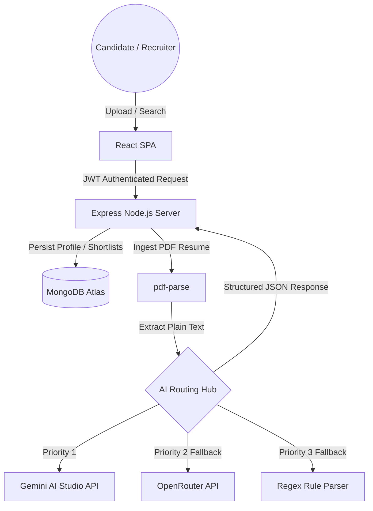

# 🌟 TalentAI – AI-Powered Talent Discovery Platform
> **"Discover Talent Beyond Resumes"**

TalentAI is a production-quality, responsive MERN-stack application designed to revolutionize technical recruitment. Rather than relying on traditional keyword-matching ATS systems that filter out stellar applicants, TalentAI leverages Google Gemini LLMs to parse, assess, score, and align candidates based on their technical depth, projects, and growth capabilities.

---

## 🏆 Key Features for Hackathon Judges

### 🧠 Intelligent AI Core & Robust Resilience
- **Gemini 1.5/2.0 Integration:** Deep analysis of resume text mapping skill alignments, candidates' top strengths, and growth recommendations.
- **Fail-Safe Fallback Pipeline:** A resilient API query structure that tries **Google Gemini AI Studio** first, falls back to **OpenRouter (Gemini-2.5-Flash)** next if API quotas are exhausted, and defaults to a local regex parser to prevent user-facing errors.
- **AI Interview Preparer:** Generates dynamic, role-specific technical and behavioral questions customized to address the candidate's exact skill gaps, complete with evaluation guidelines.

### 🎨 State-of-the-Art UX/UI Design
- **Premium Glassmorphic Aesthetics:** Dark/light mode theme toggling with smooth transitions, customized gradients, interactive cards, and modular timelines.
- **Responsive Layouts:** Tested across mobile, tablet, and desktop viewports, using a custom 8px spacing grid.

### 💼 Recruiter Super-Power Dashboard
- **Advanced Sourcing Engine:** Search filters with range sliders (match suitability score), location inputs, and dynamic tag matching.
- **Shortlists & Pipelines:** Dual display layouts (clean table view for details vs. visual grid cards for overview) to bookmark top profiles.
- **Hiring Analytics:** Visualized sourcing channels, talent pools, and applicant frequencies built using React ChartJS wrappers.

---

## 🛠️ The Tech Stack

- **Frontend:** React 18, React Router v6, Tailwind CSS, Framer Motion, Chart.js, React Icons.
- **Backend:** Node.js, Express.js, Multer (memory-storage upload), PDF-Parse (raw document ingestion).
- **AI & Integrations:** `@google/generative-ai` (Gemini SDK), OpenRouter REST API.
- **Database:** MongoDB Atlas (Mongoose Object modeling).

---

## 📡 Architecture Diagram



---

## 🚀 How to Run Locally

### 1. Prerequisites
- Node.js (version 18 or above)
- MongoDB running locally or a MongoDB Atlas connection string

### 2. Configure Environment Variables
Create a file named `.env` in the `backend/` directory:
```env
PORT=5000
MONGO_URI=mongodb://127.0.0.1:27017/talentai
JWT_SECRET=supersecretjwtkey
GEMINI_API_KEY=your_gemini_api_key
OPENROUTER_API_KEY=your_openrouter_api_key (Optional)
```

### 3. Install & Start Development Servers
From the root directory:

**Install all dependencies:**
```bash
npm run install-backend && npm run install-frontend
```

**Run Backend Server:**
```bash
npm run dev --prefix backend
```

**Run Frontend Client:**
```bash
npm run dev --prefix frontend
```
The app will be accessible at `http://localhost:5173`.

---

## ☁️ Deployment (Single Web Service on Render)

This application is fully optimized to run on **Render** under a single web service, eliminating CORS issues and reducing hosting costs.

1. Create a new **Web Service** on Render and link your fork/repo.
2. Configure settings:
   - **Build Command:** `npm run build`
   - **Start Command:** `npm start`
3. Add environment variables under Render's configuration tab:
   - `NODE_ENV` = `production`
   - `MONGO_URI` = `your_atlas_connection_string`
   - `JWT_SECRET` = `your_secret_key`
   - `GEMINI_API_KEY` = `your_gemini_key`
   - `OPENROUTER_API_KEY` = `your_openrouter_key` (Optional)
